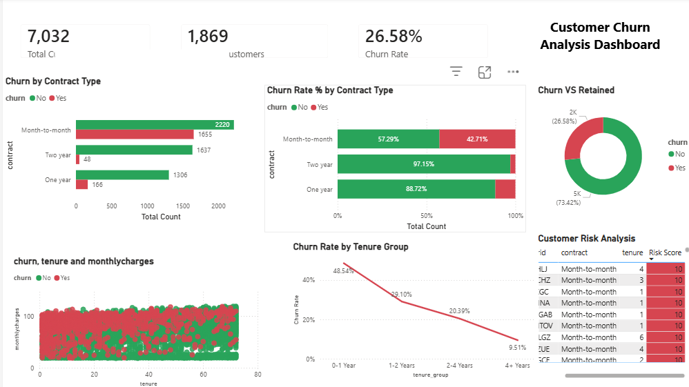

# Customer Churn Analysis Dashboard

## Project Overview

This project analyzes customer churn patterns using **Power BI**.
The goal is to identify key factors that influence customer churn and provide insights that can help businesses improve customer retention strategies.

## Tools & Technologies

* Microsoft Power BI
* Data Visualization
* Data Analysis

## Dataset Information

The dataset contains telecom customer information including:

* Customer ID
* Contract type
* Tenure
* Monthly charges
* Churn status
* Risk score

## Key Metrics

* **Total Customers:** 7032
* **Churned Customers:** 1869
* **Churn Rate:** 26.58%

## Dashboard Features

* KPI cards displaying total customers and churn rate
* Churn analysis by **contract type**
* Churn distribution visualization
* Tenure-based churn analysis
* Scatter plot showing relationship between **tenure and monthly charges**
* High-risk customer identification table

## Key Insights

* Customers with **month-to-month contracts** have the highest churn rate.
* Customers with **short tenure (0–1 year)** are more likely to churn.
* **Higher monthly charges** are associated with higher churn probability.
* Risk score helps identify **customers likely to churn**.

## Dashboard Preview

Example:

## Project Files

* `Customer_Churn_Dashboard.pbix` – Power BI dashboard file
* `dashboard-preview.png` – Screenshot of the dashboard
* `README.md` – Project documentation

## Author

Glory Evangeline
